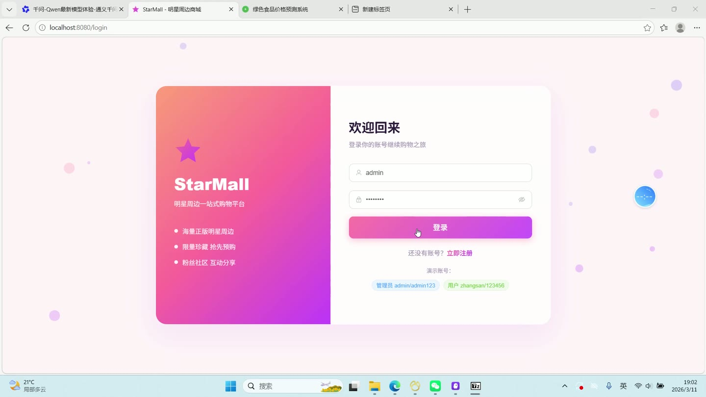
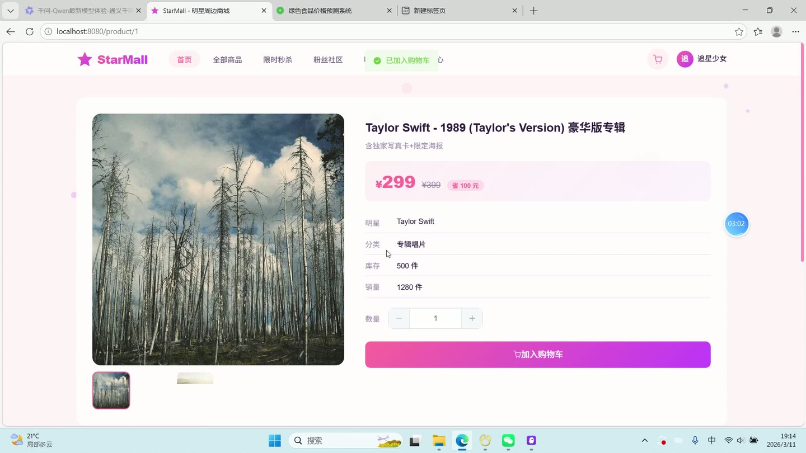
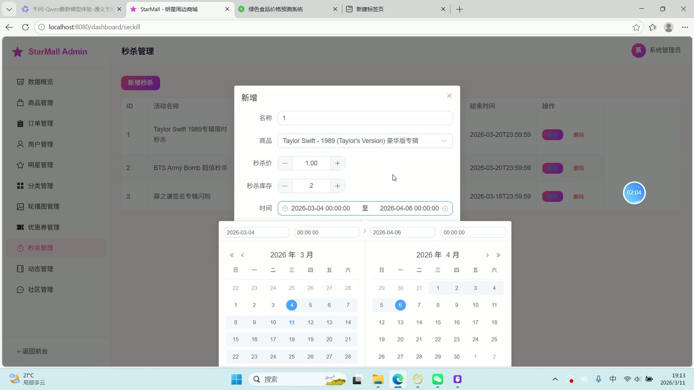
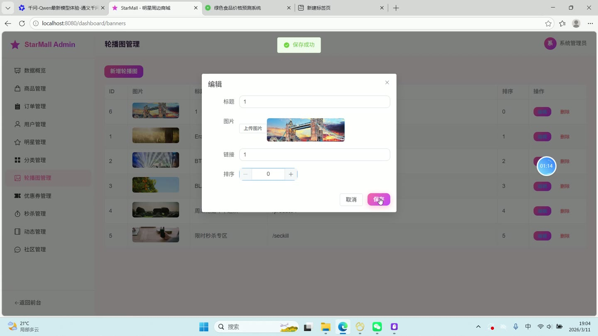
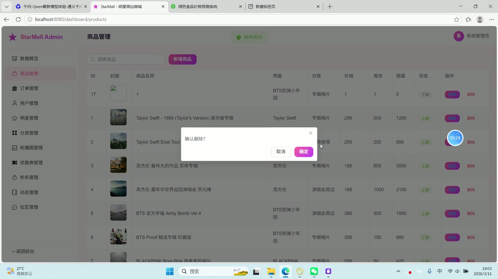

# (附文档)Springboot3+Vue3+MySQL 明星周边商城

**技术栈**：Springboot3、Vue3、MySQL

### 系统简介

StarMall 明星周边商城是一套基于 Spring Boot 3 + Vue 3 前后端分离的电商系统，支持普通用户浏览、购买明星周边商品，以及管理员后台全面管理。系统包含用户端（商品浏览、购物车、订单、社区、秒杀、优惠券）和管理员端（数据看板、商品/订单/用户/明星/分类/轮播/优惠券/秒杀/动态/社区管理）两大角色。
 
### 核心功能
 
### 普通用户端

 
- 浏览首页轮播图、热销商品、新品推荐、分类列表、明星列表及最新动态（支持按分类/明星/关键词搜索商品） 
- 查看商品详情（含商品名称、副标题、价格、原价、库存、销量、封面图、多图、视频、详情描述、关联明星与分类） 
- 将商品加入购物车（支持修改数量、勾选/取消勾选、删除单件商品、清空购物车） 
- 从购物车选择商品创建订单（填写收货人姓名、电话、地址、备注，自动生成订单号并扣减库存） 
- 查看我的订单列表（支持按订单状态筛选：待付款/已付款/已发货/已完成/已取消） 
- 对订单进行支付（模拟，更新状态为已付款并记录支付时间与支付方式） 
- 取消待付款订单（恢复商品库存与销量） 
- 确认收货（将订单状态更新为已完成，并根据支付金额增加用户积分） 
- 管理收货地址（新增、编辑、删除地址，支持设置默认地址） 
- 发表商品评价（填写评分、评价内容、上传图片，关联订单与商品） 
- 查看优惠券列表（领取可用优惠券，查看已领取的优惠券及状态） 
- 参与秒杀活动（查看进行中的秒杀活动列表，含秒杀价格与库存） 
- 浏览明星详情页（查看明星名称、头像、描述、粉丝数） 
- 查看明星动态列表（按时间倒序展示，含标题、封面、内容、阅读数） 
- 浏览粉丝社区（查看帖子列表，按明星筛选，支持置顶排序） 
- 发布社区帖子（填写标题、内容、关联明星、上传图片） 
- 对帖子点赞、发表评论（评论后帖子评论数自动+1） 
- 查看帖子详情（自动增加阅读数，查看评论列表） 
- 个人中心（查看/修改个人信息：昵称、头像、手机、邮箱；修改登录密码） 
- 用户注册（填写用户名、密码、昵称、手机号，密码使用 BCrypt 加密存储）
 
### 管理员端

 
- 数据看板（展示用户总数、商品总数、订单总数、待处理订单数；各状态订单统计；热销商品 TOP5） 
- 商品管理（分页查询商品列表，支持按关键词/分类/明星筛选；新增、编辑、删除商品，管理商品状态与排序） 
- 订单管理（分页查询订单列表，支持按订单号/订单状态筛选；查看订单详情含商品明细；发货操作填写物流公司与运单号） 
- 用户管理（分页查询用户列表，支持按用户名/昵称搜索；编辑用户信息、禁用/启用账号） 
- 明星管理（分页查询明星列表，按粉丝数排序；新增、编辑、删除明星信息） 
- 分类管理（查询分类列表，支持排序；新增、编辑、删除商品分类） 
- 轮播图管理（查询轮播图列表，支持排序；新增、编辑、删除轮播图，控制启用/禁用状态） 
- 优惠券管理（分页查询优惠券列表；新增、编辑、删除优惠券，设置名称、类型、折扣金额/折扣率、最低使用金额、总量、有效期） 
- 秒杀活动管理（分页查询秒杀活动列表，关联商品信息；新增、编辑、删除秒杀活动，设置秒杀价格与库存） 
- 明星动态管理（分页查询动态列表；新增、编辑、删除动态，设置标题、内容、封面图、关联明星） 
- 社区帖子管理（分页查询帖子列表，含用户昵称、明星名称；删除违规帖子）
 
### 技术栈

 后端框架Spring Boot 3 ORMMyBatis-Plus（含分页插件、逻辑删除） 权限JWT 认证 + 拦截器（AuthInterceptor），基于 role 字段（0-普通用户，2-管理员） 前端框架Vue 3（Composition API + setup 语法） 状态管理Pinia（userStore） 构建工具Vite 数据库MySQL 8（表：product, order_info, order_item, cart, user, address, star, category, banner, coupon, user_coupon, seckill_activity, star_news, community_post, post_comment, review） 密码加密BCrypt（Hutool 工具类） 文件上传MultipartFile + 本地存储（UUID 重命名）
 
### 交付内容

 
- 后端完整源码 
- 前端完整源码 
- 数据库初始化脚本 
- 万字文档

## 界面展示

---

## 获取完整源码 + 万字文档

本仓库为项目介绍页。**完整前后端源码、数据库初始化脚本、万字项目文档**，请加微信 `kangkangcode`，或访问 [codekk.top](http://codekk.top) 获取。

可作课程设计 / 毕业设计参考，支持远程部署调试。